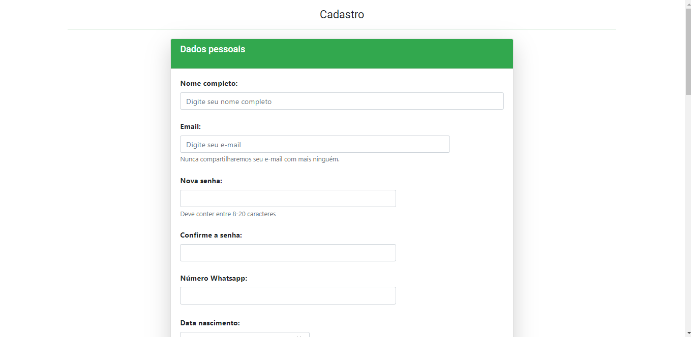

# Cz Network (front-end)

## Sobre o projeto
O Cz Network é um projeto front-end acadêmico de uma rede social.
O objetivo principal do sistema é fornecer uma aplicação front-end onde os usuários poderiam se cadastrar, realizar suas postagens, entre outras.
Para isso, foi desenvolvida uma aplicação backend, disponível em: https://github.com/hugoabrantesd/cz-network

Tecnologias utilizadas:
- Typescript
- Angular 14

### 
### 
### Login

### Cadastro

### Perfil

# Autores

- Hugo Abrantes de Lira -> Linkedin: https://www.linkedin.com/in/hugoabrantesd

- Taylson Leite
